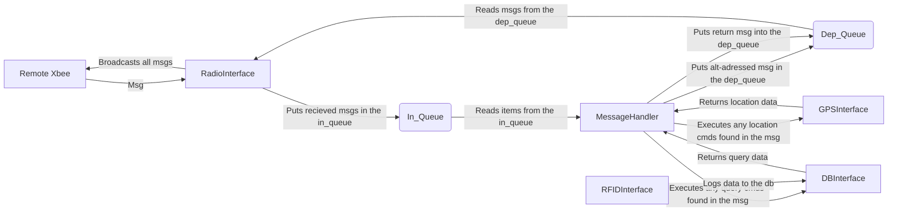

## Buoy Mesh Network - JMU Engineering

A common code base for mesh network ready buoys.\
This repository is undergoing a constant stream of updates. Feel free to check
out a branch and jump right into building with us!

## How to contribute?
Clone the repository or any branch of the repository by typing:

```
git clone https://github.com/emilHof/ng-mesh-buoy.git
```

to check out the main branch or,

```
git clone --branch <branch_name> https://github.com/emilHof/ng-mesh-buoy.git
```

to check out a specific branch.\
For example, checking out the **section3-comms-dev** branch would look like this:

```
git clone --branch section3-comms-dev https://github.com/emilHof/ng-mesh-buoy.git
```


**Have fun making!**

## Architecture

